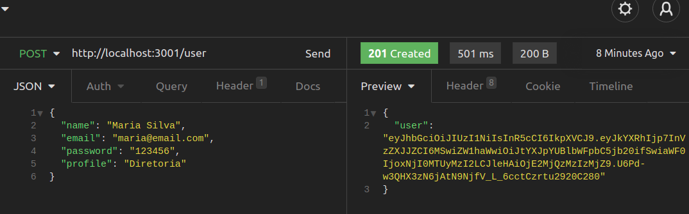
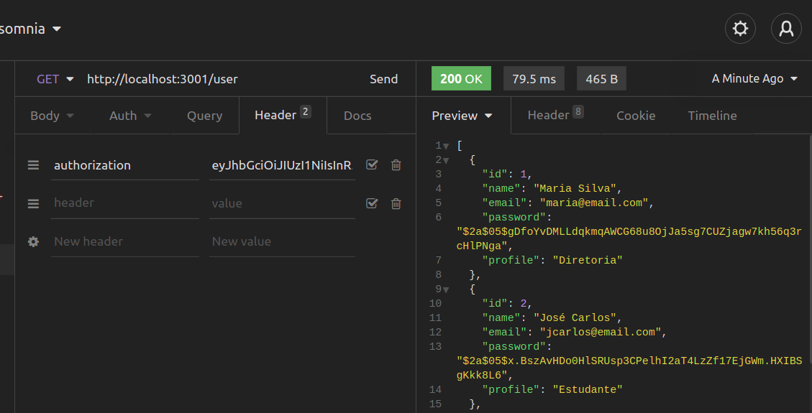

# fullstack-challenge-flavio-santos-oliveira

Desafio Técnico

Empresa: Plataforma A+

## Para executar aplicação

- Efetue o clone do repositório em sua máquina

`git clone https://github.com/flaviosoliver/fullStack-challenge-flavio-santos-oliveira.git`

- Entre na pasta onde foi criado o repositório

`cd fullstack-challenge-flavio-santos-oliveira`

- Execute a instalação de dependências e a inicialização da aplicação

`npm run install-start-full`

## Back-End

SGBD: MySQL

Ambiente de execução: Node.JS

Framework Node.JS: Express.JS

Arquitetura: ORM

Framework ORM: Sequelize

## Front-End

Interface: React.JS

### Autor

Flávio Santos Oliveira | email: flavsoliver@gmail.com

Brasil, JUNHO - 2021.

## Desafio

Desenvolver uma aplicação WEB ou APP, para controlar Alunos e Professores em suas Turmas, referentes às séries do Ensino Fundamental, em uma Escola Pública.

- A aplicação deve apresentar uma lista de Escolas Públicas:
  - Deve permitir adicionar, modificar e excluir Escolas.
  - Cada Escola deve possuir um Diretor responsável.
- As Turmas devem ser disponibilizadas ao acessar detalhes de uma Escola:
  - Deve permitir adicionar, modificar e excluir Turmas.
  - Cada Turma possui um Professor associado a ela.
    - Um Professor poderá estar associado a mais de uma Turma.
      - Deve permitir que o Diretor possa adicionar e excluir Professores em uma Turma.
  - Ao entrar nos detalhes da Turma, os alunos e professores relacionados devem ser exibidos.
    - Alunos devem ser adicionados ou excluídos das Turmas.
- Os Alunos possuem informações mínimas que devem estar contidas em seus cadastros, como:
  - Nome do Aluno
  - Nomes dos Responsáveis
  - Contatos
- Os Professores devem ser capazes de adicionar observações sobre a Turma e sobre determinado Aluno.
- A solução deve possibilitar buscar com base em alguma informação, de escolha livre, contida nas entidades.

## Soluções Implementadas

## Validações no Back-End

- Requisições de Usuário: `/user`

  - Cadastro: Para cadastrar um usuário é necessário informar campos corretamente da seguinte forma (todos os campos são obrigatórios, caso desconformidade, erro característico é retornado):

    - Nome (name): mínimo de 6 (seis) caracteres;

    - Senha (password): mínimo de 6 (seis) caracteres;

    - Email (email): padrão válido: `nome@dominio.servico` (user@escola.com)

    - Perfil (profile): são 3 (três) perfis, deve-se informar qual: `Diretoria`, `Docente` ou `Estudante`;

    - Exemplo de requisição realizada com sucesso:

    

    - Como retorno de erro nas validações temos:

      - no Status HTTP 400:

        - Nome com tamanho menor que 6 caracteres

        `'"Name" length must be at least 6 characters long'`
        - E-mail com formato inválido

        `'"email" must be a valid email'`
        - Campo e-mail inexistente ou não informado

        `'"email" is required'`
        - Senha com tamanho menor que 6 caracteres

        `'"password" length must be 6 characters long'`
        - Campo senha inexistente ou não informado

        `'"password" is required'`
        - Campo perfil inexistente ou não informado

        `'"profile" is required'`
        - Campo perfil com atribuição inexistente

        `'"profile" must be a valid profile'`

      - no Status HTTP 409:

        - Pessoa usuária já cadastrada

        `'User already registered'`

  - Listar todas as pessoas Usuárias cadastradas:

    - É preciso possuir um token para acessar a listagem de pessoas cadastradas

    - Caso não esteja com um toke válido, será gerado um Status HTTP 401 com a mensagem:

      `'Token not found'`

    - Obtendo sucesso na requisição, será exibida a listagem:

      

## Validações no Front-End
