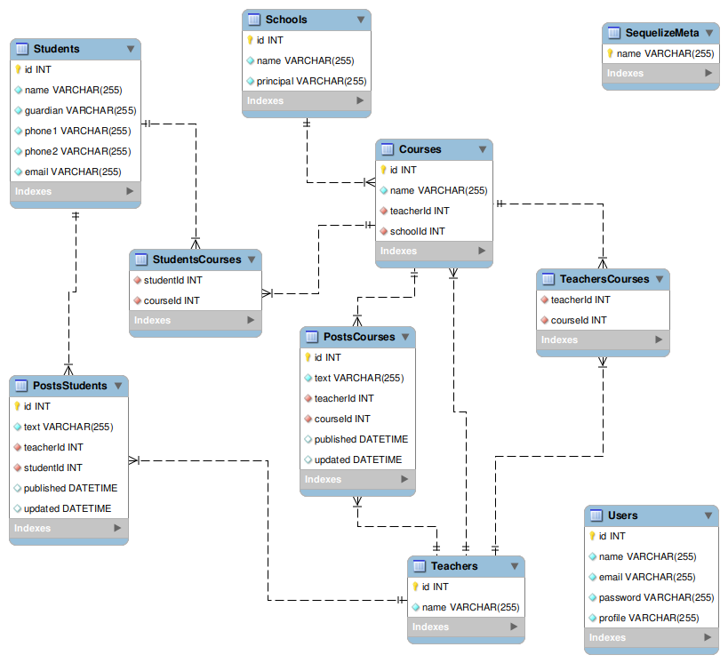
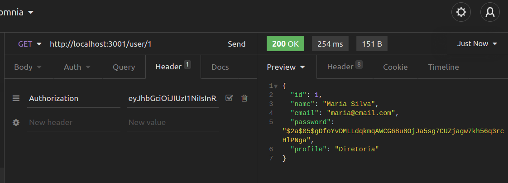
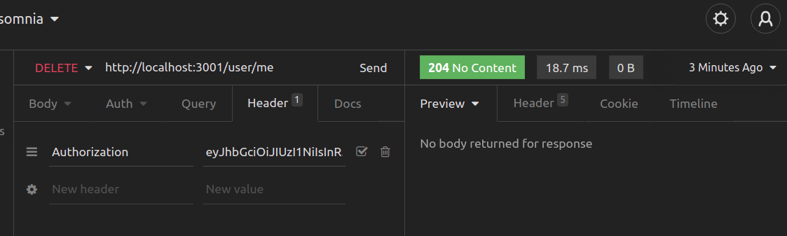
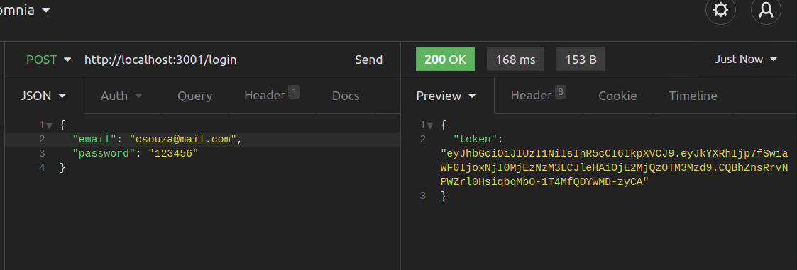
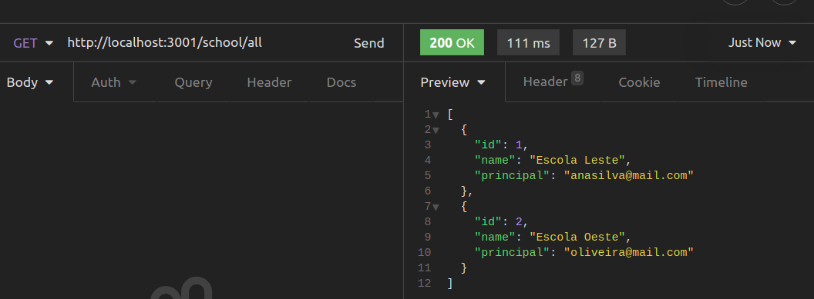
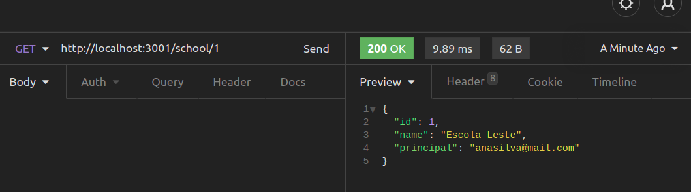

# fullstack-challenge-flavio-santos-oliveira

Desafio Técnico

Empresa: Plataforma A+

## Tags de staks utilizadas no Desafio

          

## Para executar aplicação

- Efetue o clone do repositório em sua máquina

  `git clone https://github.com/flaviosoliver/fullStack-challenge-flavio-santos-oliveira.git`

- Entre na pasta onde foi criado o repositório

  `cd fullstack-challenge-flavio-santos-oliveira`

- Execute a instalação de dependências da aplicação

  `npm run install-full`

- Faça as configurações de acesso à sua instância do MySQL através de um arquivo `.env` na raiz da pasta `back-end` preenchendo as chaves conforme a instalação do MySQL feita em sua máquina, nos campos `MYSQL_USER` e `MY_SQL_PASSWORD`

  ```js
  MYSQL_USER=seu_usario_aqui
  MYSQL_PASSWORD=sua_senha_aqui
  HOSTNAME=localhost
  PORT=3001
  ```

- Entre no diretório do back-end

  `cd back-end`

- Crie o banco `colleges` com o Sequelize

  `npx sequelize db:create`

- Crie as tabelas do banco

  `npx sequelize db:migrate`

- Popule as tabelas com o comando (exceto a tabela de pessoas usuárias `Users`, essa tabela é alimentada por meio do endpoint, seja pelo back-end, seja pelo front-end)

  `npx sequelize db:seed:all`

- Inicialize o serviço do back-end

  `npm run start`

    - Existe a instância de desenvolvimento através do `nodemon`, caso não queira executar o `Node` em modo estático

      `npm run debug`

- Saia do diretório do back-end e entre no front-end

  `cd .. && cd front-end`

- Inicialize a o front-end da aplicação

  `npm run start-front`

## Back-End

- SGBD: MySQL

- Ambiente de execução: Node.JS

  - Framework Node.JS: Express.JS

- Arquitetura: ORM

  - Framework ORM: Sequelize

- Configurado para ser executado em `http://localhost:3001`

## Front-End

- Interface: React.JS

- Configurado para ser executado em `http://localhost:3000`

## Autor

Flávio Santos Oliveira | email: flavsoliver@gmail.com

Brasil, JUNHO - 2021.

## Desafio

Desenvolver uma aplicação WEB ou APP, para controlar Alunos e Professores em suas Turmas, referentes às séries do Ensino Fundamental, em uma Escola Pública.

- A aplicação deve apresentar uma lista de Escolas Públicas:
  - Deve permitir adicionar, modificar e excluir Escolas.
  - Cada Escola deve possuir um Diretor responsável.
- As Turmas devem ser disponibilizadas ao acessar detalhes de uma Escola:
  - Deve permitir adicionar, modificar e excluir Turmas.
  - Cada Turma possui um Professor associado a ela.
    - Um Professor poderá estar associado a mais de uma Turma.
      - Deve permitir que o Diretor possa adicionar e excluir Professores em uma Turma.
  - Ao entrar nos detalhes da Turma, os alunos e professores relacionados devem ser exibidos.
    - Alunos devem ser adicionados ou excluídos das Turmas.
- Os Alunos possuem informações mínimas que devem estar contidas em seus cadastros, como:
  - Nome do Aluno
  - Nomes dos Responsáveis
  - Contatos
- Os Professores devem ser capazes de adicionar observações sobre a Turma e sobre determinado Aluno.
- A solução deve possibilitar buscar com base em alguma informação, de escolha livre, contida nas entidades.

## Soluções Implementadas

  - Estruturação de Banco de Dados

    - Nome do Banco de Dados:
      `colleges`
    - (EER) Diagram
      

## Validações no Back-End

- Requisições de Usuário: `/user`

  - Cadastro: Para cadastrar um usuário é necessário informar campos corretamente da seguinte forma (todos os campos são obrigatórios, caso desconformidade, erro característico é retornado), verbo/rota `POST /user`:

    - Nome (name): mínimo de 6 (seis) caracteres;

    - Senha (password): mínimo de 6 (seis) caracteres;

    - E-mail (email): padrão válido: `nome@dominio.servico` (user@escola.com)

    - Perfil (profile): são 3 (três) perfis, deve-se informar qual: `Diretoria` ou `Docente`;

    - Exemplo de requisição realizada com sucesso:
    

    - Como retorno de erro nas validações temos:

      - no Status HTTP 400:

        - Nome com tamanho menor que 6 caracteres

          `'"Name" length must be at least 6 characters long'`

        - E-mail com formato inválido

          `'"email" must be a valid email'`

        - Campo e-mail inexistente ou não informado

          `'"email" is required'`

        - Senha com tamanho menor que 6 caracteres

          `'"password" length must be 6 characters long'`

        - Campo senha inexistente ou não informado

          `'"password" is required'`

        - Campo perfil inexistente ou não informado

          `'"profile" is required'`

        - Campo perfil com atribuição inexistente
        
          `'"profile" must be a valid profile'`

      - no Status HTTP 409:

        - Pessoa usuária já cadastrada
          
          `'User already registered'`

  - Listar todas as pessoas Usuárias cadastradas, verbo/rota `GET /user`:

    - É preciso possuir um token para acessar a listagem de pessoas cadastradas

      - Se não estiver com um token válido, será gerado um Status HTTP 401 com a mensagem:
        
        `'Expired or invalid token'`

        - Se o token não for encontrado
          
          `'Token not found'`

    - Obtendo sucesso na requisição, será exibida a listagem:
      

  - Listar pessoa Usuária através do Id, verbo/rota `GET /user/:id`

    - Caso requisite por um Id não existente, será exibido o Status HTTP 404, com a mensagem:

      `'User does not exist'`

    - Se não estiver com um token válido, será gerado um Status HTTP 401 com a mensagem:

      `'Expired or invalid token'`

      - Se o token não for encontrado

        `'Token not found'`

    - Obtendo sucesso na requisição, será exibida a listagem:
    

  - Apagar: a pessoa usuária poderá apagar o seu prórpio cadastro da tabela Users

    - Se não estiver com um token válido, será gerado um Status HTTP 401 com a mensagem:

      `'Expired or invalid token'`

      - Se o token não for encontrado

        `'Token not found'`

    - Estando com o token válido
    

  - Requisições de Login: `/login`

    Sendo usuária já cadastrada no sistema, a pessoa pode realizar o login e ter o seu token gerado

    - Validações de login, campos e-mail e senha são obrigatórios

      - E-mail e senha devem ser informados corretamente
        

      - E-mail com formato inválido

        `'"email" must be a valid email'`

      - Campo e-mail inexistente ou não informado

        `'"email" is required'`

      - Campo senha inexistente ou não informado

        `'"password" is required'`

      - E-mail ou senha incorretos

        `'Invalid fields, "email" or "password" incorrect'`

- Requisições de Escola: `/school`

  - Endpoint para lista todas Escolas, verbo/rota `GET /school/all`
    
  
  - Listar pessoa Usuária através do Id, verbo/rota `GET /school/:id`
    


## Validações no Front-End

  - Ao iniciar a aplicação, será aberto o site na tela de login, `http://localhost:3000/login`

  - O botão `Entrar` permanece desativado até a pessoa inserir um e-mail de formato válido e uma senha com no mínimo 6 (seis) caracteres.
  
  - Caso insira valores que divergem do cadastro do Banco de Dados, será exibido uma mensagem de alerta

    `'E-mail ou Senha incorretos. Tente novamente.'`
  
  - Quando inserir os dados corretos e clicado em `Entrar`, o site será redirecionado para a Home conforme o seu perfil (Diretoria ou Docente)
  
    `http://localhost:3000/home/diretoria` || `http://localhost:3000/home/docente`

  - Ao clicar no botão `Ainda não tenho cadastro` será redirecionado para a tela de cadastro
